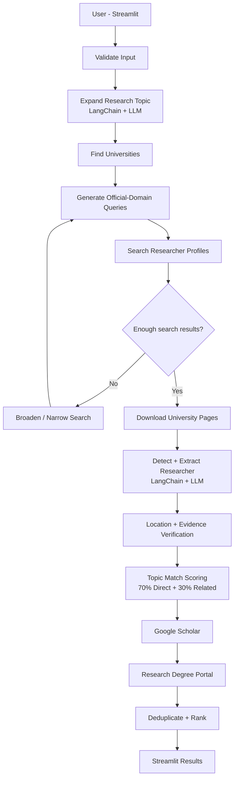

# Australian Researcher Finder

A LangGraph-based application for finding Australian university researchers who work on a given research topic.

The system searches official university websites, extracts researcher information from personal academic profiles, verifies the evidence, scores researchers against the user's topic, and returns ranked results with useful research links.

## Features

- Search researchers by Australian state and research topic
- Search only official university domains
- LLM-based research-topic expansion
- Personal researcher-profile detection
- Structured researcher extraction
- Australian state and country filtering
- Deterministic profile verification
- Explainable topic-match scoring
- Duplicate researcher removal
- Ranked researcher results
- Google Scholar profile discovery
- University PhD / MRes / Masters-by-Research portal discovery
- Streamlit user interface
- Groq and Ollama LLM support
- Graceful handling of partial search/download/LLM failures

## Example

Input:

```text
Country: Australia
State: Victoria
Research topic: Machine Learning
Maximum results: 3
```

Example result:

```text
Researcher: abc
University: abc University

Research interests:
Machine Learning
Artificial Intelligence
Data Mining
Reinforcement Learning
Computer Vision

Topic match: 100/100

Links:
Official university profile
Google Scholar
University research-degree opportunities
```
## Architecture



## How It Works

```text
START
  ↓
Initialize workflow
  ↓
Validate input
  ↓
Expand research topic
  ↓
Find universities in selected state
  ↓
Generate official-domain researcher queries
  ↓
Search researcher profiles
  ↓
Download and clean profile pages
  ↓
Extract researcher information
  ↓
Filter by state / country
  ↓
Verify official profile evidence
  ↓
Score topic relevance
  ↓
Find Google Scholar profile
  ↓
Find university research-degree portal
  ↓
Remove duplicates
  ↓
Rank researchers
  ↓
Generate final output
  ↓
END
```

LangGraph controls the workflow and conditional search-routing logic.

## Researcher Verification

A researcher is accepted only when the system can verify the researcher against the downloaded official university profile.

Verification checks that:

- the profile belongs to the university's official domain
- the downloaded page matches the researcher's profile URL
- the researcher's name appears on the page
- the extracted evidence exists in the original page
- the page represents a researcher profile rather than a publication, project, directory, news page or author list

The extraction stage also captures the researcher's current country and Australian state when the official profile provides that information.

This prevents researchers from overseas campuses being returned for the wrong Australian state.

## Topic Match Scoring

Researchers are scored from `0–100` using their research interests from the official university profile.

```text
Final score =
70% direct topic match
+
30% related-topic match
```

### Direct match — 70%

Compares the user's original search topic directly with the researcher's listed research interests.

Example:

```text
User topic:
Machine Learning

Research interest:
Machine Learning
```

This produces a strong direct match.

### Related-topic match — 30%

The topic-expansion stage generates closely related research concepts.

These related topics are compared with the researcher's official research interests.

For example:

```text
User topic:
Reinforcement Learning

Related topics:
Machine Learning
Artificial Intelligence
Deep Reinforcement Learning
```

This helps identify researchers whose profiles use related academic terminology.

Researchers with a final relevance score below `40` are excluded from the final ranking.

## Result Ranking

Remaining researchers are ranked using:

```text
1. Overall relevance score
2. Direct topic-match score
3. Related-topic score
4. Verified source count
5. Researcher name
6. University name
```

The requested maximum number of strongest researchers is then returned.

## Researcher Links

Each result can include:

### Official University Profile

The researcher's name links directly to the verified university profile used by the system.

### Google Scholar

The system searches for a Google Scholar author profile using the researcher's name and university.

The Scholar link is displayed only when a valid Scholar profile URL is found.

### Research-Degree Opportunities

For each researcher's university, the system searches for one central page covering opportunities such as:

```text
PhD
MRes
Master by Research
Masters by Research
Graduate Research
Higher Degree Research
```

The system searches once per university and reuses the result when multiple researchers belong to the same university.

## Technology Stack

| Technology | Purpose |
|---|---|
| Python 3.12 | Application language |
| LangGraph | Workflow orchestration |
| LangChain | LLM integration |
| Groq / Ollama | LLM providers |
| Pydantic | Structured data validation |
| DDGS | Web search |
| httpx | University webpage downloading |
| BeautifulSoup4 | HTML cleaning |
| pycountry | Location validation |
| Streamlit | User interface |
| Pytest | Automated testing |
| Ruff | Code quality |

## Project Structure

```text
supervisor-finder/
│
├── app.py
├── pyproject.toml
├── README.md
│
├── src/
│   └── research_finder/
│       ├── config.py
│       ├── deduplication.py
│       ├── graph.py
│       ├── llm.py
│       ├── location.py
│       ├── models.py
│       ├── nodes.py
│       ├── official_page_search.py
│       ├── ranking.py
│       ├── relevance.py
│       ├── research_projects.py
│       ├── researcher_extraction.py
│       ├── routes.py
│       ├── scholar.py
│       ├── search_queries.py
│       ├── search_strategy.py
│       ├── state.py
│       ├── topic_expansion.py
│       ├── university_directory.py
│       ├── verification.py
│       ├── web_content.py
│       └── web_search.py
│
└── tests/
```


## Design Principles

The project intentionally keeps the workflow simple.

The system does not attempt to build a complete academic knowledge graph or scrape entire university websites.

Its core objective is:

```text
Research topic
    ↓
Official university researcher profiles
    ↓
Verified researcher interests
    ↓
Relevant ranked researchers
```


The official researcher profile remains the primary evidence source.

## Current Limitations

The project currently focuses on Australian universities.

Researcher discovery depends on publicly indexed university webpages and web-search results, so it may not discover every relevant researcher at a university.

Some university websites block automated page access or expose profile information using JavaScript, which can reduce extraction coverage.

Google Scholar profiles are not guaranteed to be discovered for every researcher.

LLM providers can also enforce request or token rate limits during large searches.

Search quality therefore prioritises verified results over claiming complete coverage.

## Future Improvements

Potential improvements include:

- improve researcher-search recall for broad topics
- reduce end-to-end search time
- parallelise safe web-search and download operations
- improve university profile discovery
- add more countries
- deploy the application publicly

## License

This project is currently provided for educational   purpose.
